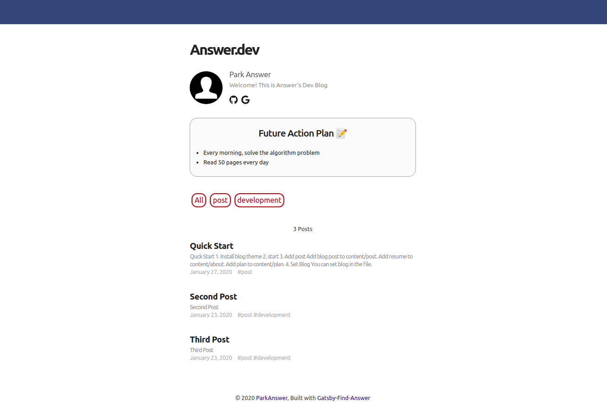

# gatsby-starter-answer



## 🌱 Demo

- [Default Theme](https://answer.netlify.app/)

## 📋 Feature

- Emoji
- Social Icon(fontawesome)
- Google Analytics
- Disqus
- Resume
- Place plan on the top

## 🚀 Quck Start

### 1. Install blog theme

```bash
gatsby new my-blog https://github.com/passwd10/gatsby-starter-answer
```

### 2. start

```bash
cd my-blog
gatsby develop
```

### 3. Add post

- Add blog post to content/post.
- Add resume to content/about.
- Add plan to content/plan.

### 4. Set Blog

- You can set blog in the `gatsby-meta-config.js` file.
